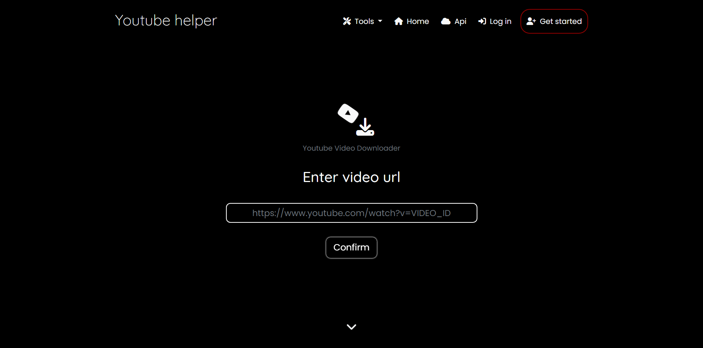
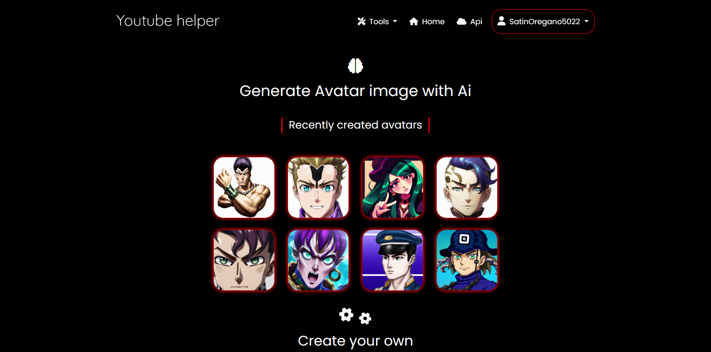
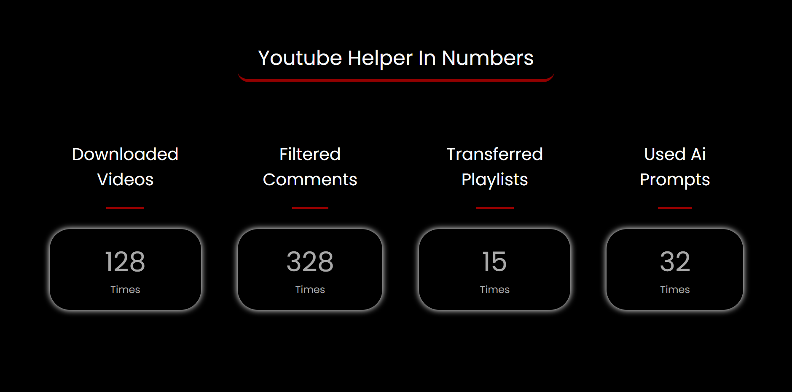
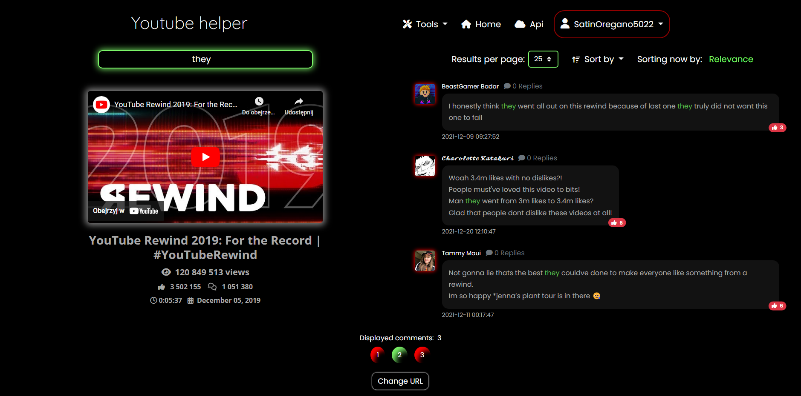
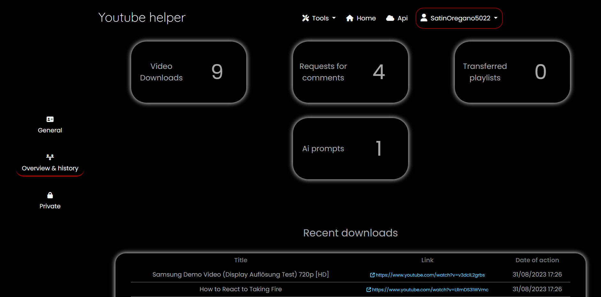

# Youtube Helper
> Youtube Helper is an application that offers free tools that use materials from the Youtube website

## Table of Contents
* [General Info](#general-information)
* [Technologies Used](#technologies-used)
* [Features](#features)
* [Screenshots](#screenshots)
* [Setup](#setup)
* [Project Status](#project-status)
* [Acknowledgements](#acknowledgements)
* [Contact](#contact)


## General Information
- The application offers such tools as:<br>
    - Video downloader including multiple formats<br>
    - Filtering comments attached with sorting and searching phrases<br>
    - Transferring youtube playlists to spotify account<br>
    - Ai powered avatar generator

- You have an overview of the history of your activities and the ability to customize your account settings
- You can access and use free api of the application to get your history data
- The application uses a message broker for scheduling long-running tasks such as generating playlist or sending user's avatars to aws bucket

## Technologies Used
- Django - v4.2.4
- Django Rest Framework - v3.14.0
- Bootstrap - v5.2.2
- JQuery - v3.2.1
- Docker - v23.0.5


## Features
- You can create account and manipulate user settings
- You can use free tools including api service
- You can check your recent activity and go back to items history


## Screenshots







## Setup
If you want to open project locally: 

```
(on Windows, Linux, MacOS) 
cd into the main directory then:

$ docker compose build
$ docker compose up
```

## Project Status
_working on_


## Contact
Created by [@Jacob](mailto:jwis02202@gmail.com) - feel free to contact me!
